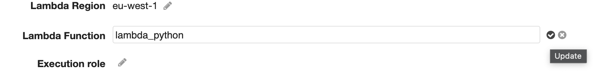

# AWS Secret Management

## Repo description

This is a terraform repository that provides a solution to decrypt in a secure way an encrypted file which was encrypted with an AWS KMS key, and insert the decrypted content as a secret in AWS Secret Manager allowing the possibility to have

The infrastructure provided by this repo consists on:

- <b>AWS API gateway</b> A rest API serving POST requests accepting the encrypted file as a data-binary parameter.

- <b>Lambda function</b> Lambda written in python which decrypts the encrypted file content and inserts it as a secret in AWS Secret Manager.

- <b>IAM roles</b> All the roles and privileges needed for executing API-Lambda services.

- <b>Secret Manager</b> As a storage of secrets inserted by the Lambda function.

- <b>KMS Keys</b> As a storage of Keys for decrypting files previously encrypted with the same key.


## Files and Folder structure
 - iac folder is a directory dedicated to terraform code in for providing the infrastructure.
 - files folder is a directory dedicated to save the rest of the files needed for the repo, like python lambda code or testing files.
 - images folder is a directory dedicated to keep the images of this README file.
 - credentials.json file it's a JSON file containting the credentials data like username, password, environment where the password is used and the desidered name for the secret.

## Variables

All the variables are already set in the variables file but they can be changed as your preference.

```
aws_region: AWS region where the code can be executed.
iam_policy_arn: Array for aws policies to be attached to the IAM role.
credentials_file: Set credentials file path.
encrypted_file: Set encrypted_file path.
api_name: Set the desidered API name.
http_method: Set the API HTTP METHOD, by default the value is POST but also can be set PUT.
stage_name: Set the desidered API stage name.
function_name: Set Lambda function name.
python_runtime: Set the python version for running lambda function.
```

#### output vars
As output variables are set two commands:
```
encrypt_command: AWS CLI command for encrypting credentials.json file before testing API.
api_url: Curl command for testing API.

```

## Improvements - PoC

The logic implemented on this repository is based on avoiding to save in disk the password in plain text, so sending an encrypted file by API no ones (without the KMS key) can "capture" the password. After that, the Lambda function decrypts and insert the secret in AWS Secret Manager really fast (Lambda spends less than 1.5 seconds executing it).

Depending on how the passwords are currently being saved in a repo, the credentials file must be in different format, so Lambda must be adapted to the new format.

 :warning: **The repo is not working once it has been deployed due to a BUG in AWS. It must be fixed manually**

 [BUG Info](https://github.com/krisgholson/serverless-thumbnail)

## DEMO

Terraform Apply


<br/><br/>

If the scenario is tested just after applying Terraform, an error 500 is got it

```
MacBook-Pro-de-Avi:iac sergio.sans$ aws kms encrypt  --key-id xxxxxxxxxxxxxx --plaintext fileb:///Users/sergio.sans/repos/challenges/aws_secrets_management/files/credentials.json --output text  --query CiphertextBlob | base64 --decode  > /Users/sergio.sans/repos/challenges/aws_secrets_management/files/encrypted

MacBook-Pro-de-Avi:iac sergio.sans$ curl -X POST -H 'Accept:*/*' -H 'Content-Type:application/octet-stream' --data-binary @../files/encrypted https://u6cvve7vo5.execute-api.eu-west-1.amazonaws.com/v1
{"message": "Internal server error"}
```

So, Once Terraform has been applied, go to the api


<br/><br/>

Go to the method and click on "Integration Request"


<br/><br/>

Click on the pencil (Edit) next to Lambda Function


<br/><br/>

Click on :white_check_mark: in order to update the value


<br/><br/>

Click OK for confirming the permission update


<br/><br/>

Deploy the API again for publish the permission updated

<br/><br/>

After fixing the bug, next test should be successful waiting for a minute after deploying API.

```
MacBook-Pro-de-Avi:iac sergio.sans$ curl -X POST -H 'Accept:*/*' -H 'Content-Type:application/octet-stream' --data-binary @../files/encrypted https://u6cvve7vo5.execute-api.eu-west-1.amazonaws.com/v1
{"Response": {"ARN": "arn:aws:secretsmanager:eu-west-1:xxxxxxxxx:secret:testing/mysql_secret_X-N9ssAu", "Name": "testing/mysql_secret_X", "VersionId": "xxxxxxxxx-xxxxxx-xxxxxxxx", "ResponseMetadata": {"RequestId": "adfsd324232cd--32423423423-423", "HTTPStatusCode": 200, "HTTPHeaders": {"date": "Mon, 20 Sep 2021 01:36:44 GMT", "content-type": "application/x-amz-json-1.1", "content-length": "175", "connection": "keep-alive", "x-amzn-requestid": "1fsdfsdf-fdsfsdfsdfwrt-sdfsdfsdf"}, "RetryAttempts": 0}}}
```
